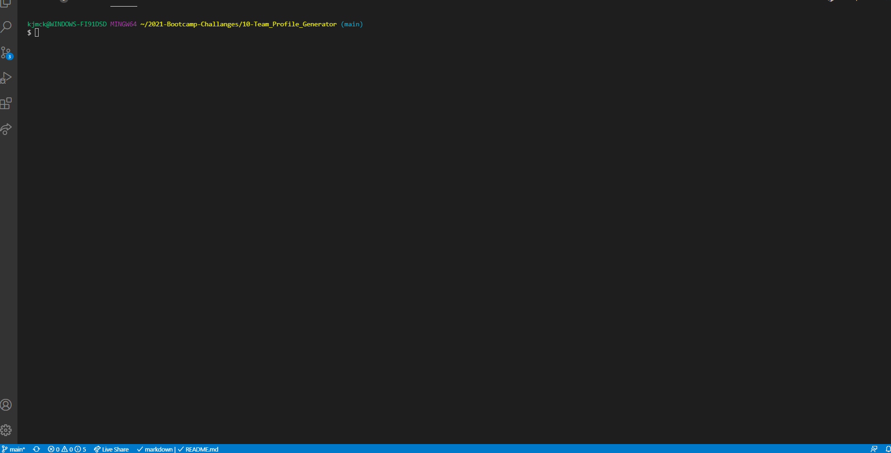
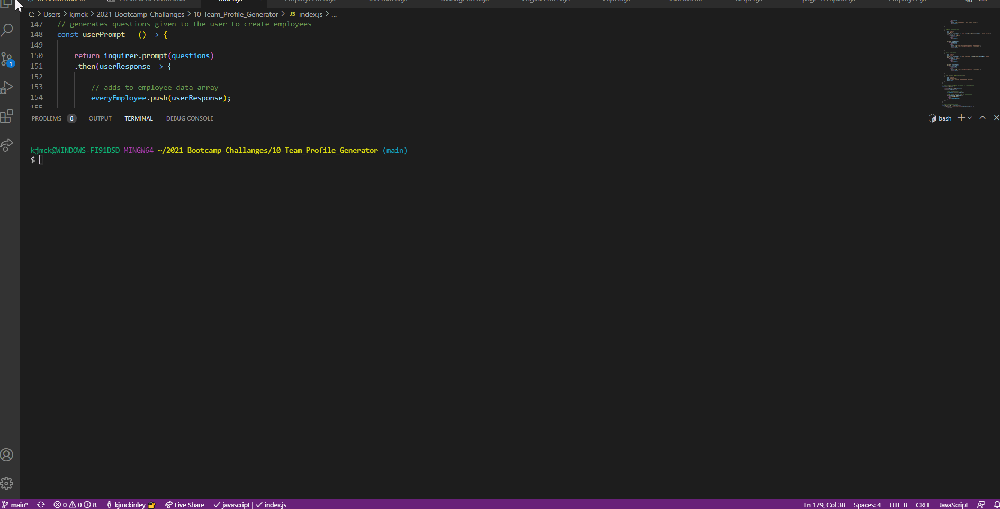
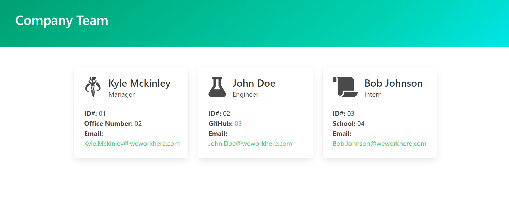

# Team Profile Generator

This application serves as a simple way to input information when prompted to generate a team for a company. Through the use of inquirer and various .js files, the user will be able to follow a series of prompts allowing them make a Manager, Engineer or Intern to be on their Team.

## User Story

```md
AS A manager
I WANT to generate a webpage that displays my team's basic info
SO THAT I have quick access to their emails and GitHub profiles
```

## Demo

The following animation demonstrates how all the tests pass the test given by the jest package


The following is a video example of how the application works


The following image shows the generated HTML’s appearance and functionality. The styling in the image is just an example, so feel free to add your own styles:


## Installation
### npm i
### npm init
### npm install inquirer
### npm install jest


## Instruction
in the console, type 'node index' to open the inquirer, then open the dist/index.html file in the browser to see the magic!!


## Links
[Github Repo](https://github.com/kjmckinley/team-profile-generator.git)

[Live Link](https://kjmckinley.github.io/team-profile-generator/)


## Resources
Thanks so much to Ritchie Ortiz for helping get this up in running.
Also to github: deckiedevs for suffering for us so that we didn't have to suffer (as much).

